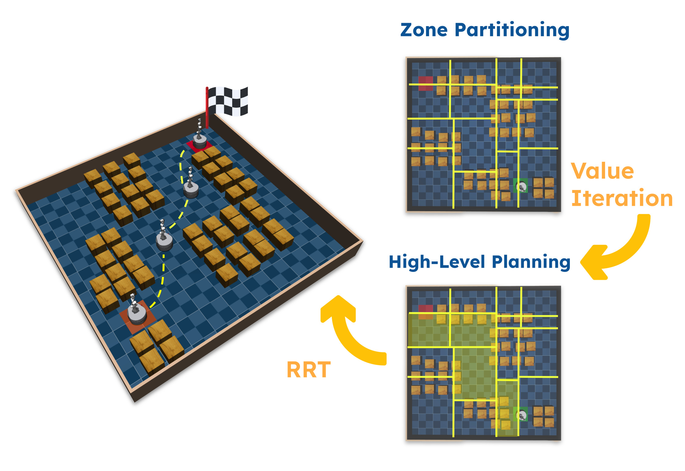
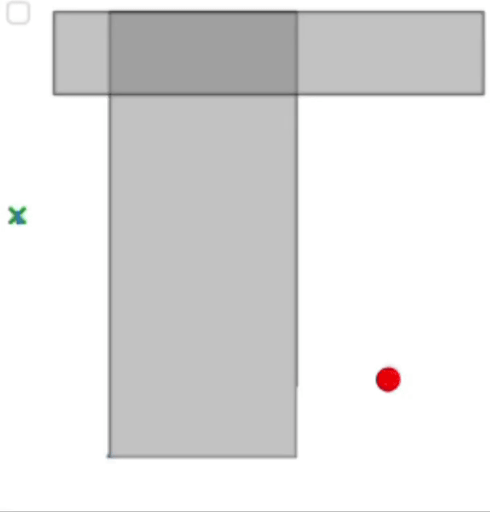
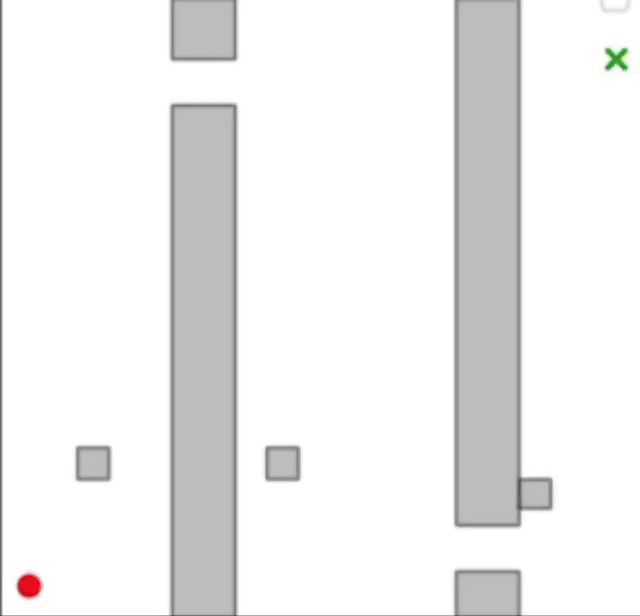

# Zonal RL-RRT: Integrated RL-RRT Path Planning with Collision Probability and Zone Connectivity

## Overview
This repository contains the implementation and supplementary materials for our paper:

**Zonal RL-RRT: Integrated RL-RRT Path Planning with Collision Probability and Zone Connectivity**

Authors: A.M. Tahmasbi, M. Saleh Faghfoorian, Saeed Khodaygan, Aniket Bera  
<!-- [GitHub Repository](https://github.com/saleh-faghfoorian/RL-RRT-KDTree.git) -->

## Introduction
Path planning in high-dimensional spaces is a challenging problem, requiring both time efficiency and high success rates. Our proposed algorithm, **Zonal RL-RRT**, introduces kd-tree partitioning to segment the environment into zones, addressing zone connectivity and ensuring smooth transitions between zones. This approach significantly improves computational efficiency while maintaining robust performance across diverse environments.


*Figure 1: Illustration of our Zonal RL-RRT approach.*

## KD-Tree Partitioning
A key component of our approach is **kd-tree partitioning**, which dynamically segments the environment based on obstacle distribution. This enables more efficient pathfinding by reducing complexity and enhancing local sampling strategies.



*Figure: An example of kd-tree partitioning applied to a cluttered environment.*


*Figure: An example of kd-tree partitioning applied to a cluttered environment.*

## Zone Connectivity
To ensure smooth navigation, we establish **zone connectivity** by analyzing shared boundaries between partitions. Using Value Iteration, our algorithm determines the optimal sequence of zones to traverse, minimizing computational overhead while ensuring high success rates.

<!--   -->
<!--   -->
*Figure: Visualization of zone connectivity and transitions.*

## Robot and 3D Environment Simulations
Our algorithm has been tested in both **2D and 3D environments**, as well as on a **6-DOF UR10e robotic arm in MuJoCo**. The following simulations demonstrate how Zonal RL-RRT effectively generates feasible and efficient trajectories.

<!--   -->
<!--  --> 
*Figure: Robot motion planning and 3D environment navigation.*

## Key Contributions
- **Efficient Zone Partitioning**: Kd-tree partitioning dynamically adjusts to environment complexity.
- **Optimized High-Level Planning**: Reinforcement learning (Value Iteration) ensures optimal zone traversal.
- **Scalability**: Demonstrates robust performance in **2D, 3D, and 6D environments**.
- **Real-World Application**: Tested on **UR10e robotic arm in MuJoCo**.

## Installation
To set up and run the algorithm, follow these steps:
```bash
# Clone the repository
git clone https://github.com/saleh-faghfoorian/RL-RRT-KDTree.git
cd RL-RRT-KDTree

# Install dependencies
pip install -r requirements.txt
